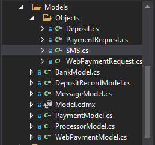

# Models

> Models is a folder that contains classes where all the application business logic, validation logic and database access logic are maintained. These are classes that the controllers act on to carry out the necessary actions on. Below is the structure of the Models folder. Most of these classes are actual table names as can be found in mdw or exigo databases. Please do not add classes here if they are not actual table names or DTO objects.

# Views

> Views is a folder that contains the various views in the system that can be rendered to the users of the systems. These views are automatically created when you create a new controller for a new provider and they match the name of the new controller that you create. When an integration requires a UI flow such as displaying 

# Controllers

> Controllers contain the flow logic control of the project. In this project the controllers represent different providers which are all inside the Gateway folder. These providers are new payment integrations for setting up a payment system for a new market or payment system. 

