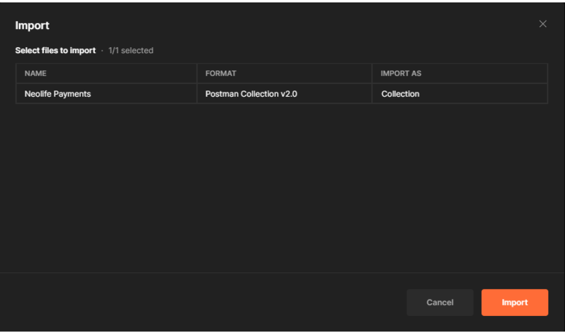
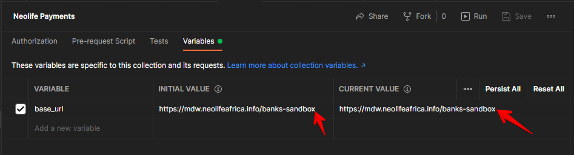
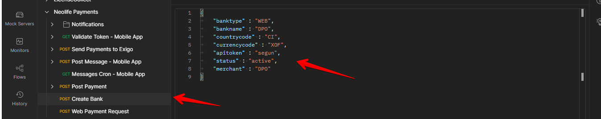
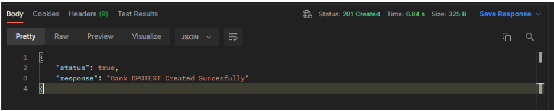

# Steps for Setting Up A New Payment Integration for WEB.

### Step 1  

Import this link into your POSTMAN. Click on File then click on Import. It will open up the image below and then you can add the link in the box where there is “Enter a URL”

POSTMAN Collections => https://www.getpostman.com/collections/98ebab06c2843fdf5805

### Step 2 

Once this is done it will open the new window with a prompt for you to import. Click on Import and this will import Neolife Payments collections into your POSTMAN

### Step 3

Once this is imported successfully, proceed to changing the BASE url. Select the Neolife Payments and click on Variables. Change the variable name to sandbox endpoint for both the Initial and Current Value

Endpoint =>  https://mdw.neolifeafrica.info/banks-sandbox

### Step 4  

Once you are sure you’ve changed the endpoint to the right endpoint. You can go ahead to Create a New Bank. Simply click on Create Bank and then go ahead to create a new bank. 

**banktype** : This is usually written as WEB for online payments that will be sitting on shop neolife

**bankname** : This is usually the bank name of the new provider which should match the name of the controller in the banks project

**countrycode** : This is the country code of the provider which is usually the country that requested the integration

**currencycode** : This is the currency of the country the integration is been done for.

**apitoken** : This is usually segun

**status** : This is active

**merchant** : This is the merchant name of the new provider. Usually it’s always the same as the bankname

### Step 5 

 Once you have added the right contents, you can go ahead and send the request and you will receive the response that the Bank has been created successfully. 

### Step 6  

The next step is to create a controller in the banks project and name your controller to match the name of the Bank you just created. As you can see this matches the name of the bank we created on Sandbox

### Step 7 

Create your project and start the payment integration. Once you create the controller, this usually generates a view folder where you can add the UI in the case there is any UI in the project. Also the Web.conf file is also where you add the credentials for payments like apikey the provider provided and other sensitive data that are made available by the provider

