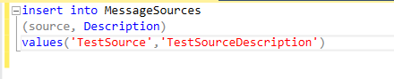
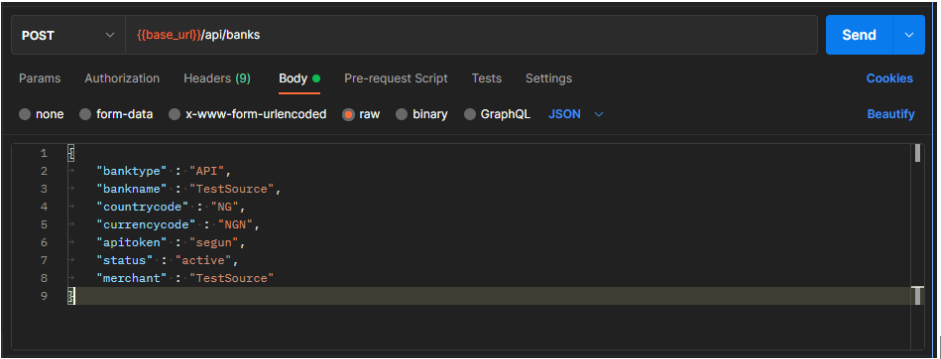
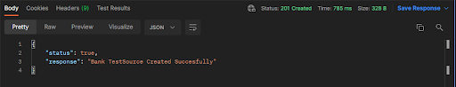
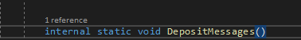

# Steps For Setting Up A New SMS Notification In Banks Project

Most providers don’t send a standard notification using our endpoint channel. For cases like these, they usually send us an sms or email of payment transactions which we then consume and send to our messages table in mdw which is then saved into Exigo. Follow the steps below to achieve the flow.

### Step 1 

Create the provider/bank in the messagesources table on mdw BanksApiSandbox.Creating this usually requires the Source of the text/email notification which is always the name of the bank sending in the notification while the description is also the description used to whitelist the subject of the email or sms coming from the provider.

### step 2

Once this record is created. You will also go back to the Postman collections of Neolife Payments and create that provider. The major difference is that the bank type will change from WEB to API.

Once this is created, the response will come back that the Bank/provider have been created successfully as seen in the screenshot below

### Step 3

Go to the MessageModel class and add the logic for consuming the SMS in the method DepositMessages. This will link you to the ProcessorModel class where you can finally add the provider.

